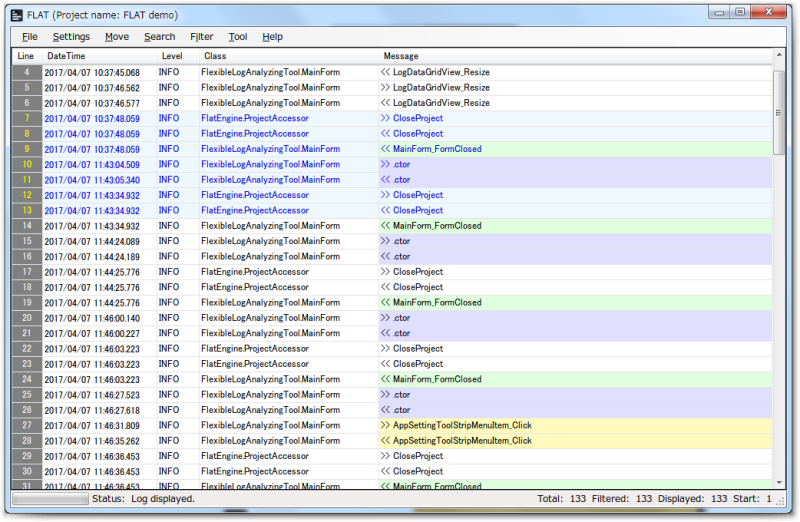

日本語版のREADMEは<a href="README.ja.md">こちら</a>

# FlexibleLogAnalyzingTool (FLAT)

*Convert various log files to unified log format. And it has some useful analyzing functions.*

## About FLAT

Did followings ever happen to you on your product or system support?
* Have to analyze different format log files crossover
* Cannot open very big log file
* Forgot search keywords for past analyzing
* Export target log lines manually to excel file

FLAT has very strong log analyzing functions.  
* You can check log files with unified format.  
* You can open big log files quickly.  
* You can reproduce past analyzing result anytime.  
* You can export target log lines to CSV or Excel file.

FLAT can be help your support work.

## Getting Started

This section will guide prerequisites, installing and usage.

### Requirements

This application is developed on Windows environment. And it needs [.NET Framework 4.5](https://www.microsoft.com/download/details.aspx?id=30653) later.

### Installing

Unpack the product zip file to your arbitary directory. And run "FlexibleLogAnalyzingTool.exe" file.

** Note **  
This application creates several setting files and directorys to application running directory.  
If you deploy this application to "Program Files" or "Program Files (x86)" directory then please add "full control" privilege to file system security.

### Usage

Please see [Usage page](../../wiki/Usage).

## Built With

* [SQLite](https://www.sqlite.org/) - Internal database
* [NPOI](https://npoi.codeplex.com/) - Export Excel function
* [Application Icon](http://gentleface.com/free_icon_set.html) - Used to Application icons

## Versioning

We use [SemVer](http://semver.org/) for versioning. For the versions available, see the [tags on this repository](https://github.com/your/project/tags). 

## Authors

* **Miura Acoustic** - *Initial work* - [S1 Products](https://github.com/PurpleBooth)

See also the list of [contributors](https://github.com/your/project/contributors) who participated in this project.

## License

This project is licensed under the MIT License - see the [LICENSE.md](LICENSE.md) file for details
